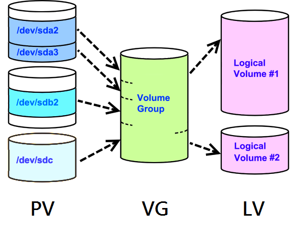

# 透過 LVM 調整 xfs File System Size
## Reference
- [邏輯捲軸管理員 (Logical Volume Manager)](http://linux.vbird.org/linux_basic/0420quota.php#lvm)
- [Linux LVM (建立、擴充、移除 LVM 磁區) 操作筆記](https://sc8log.blogspot.com/2017/03/linux-lvm-lvm.html)
- [LVM 基本管理](https://www.itread01.com/content/1578488584.html)
- [好用的 Linux LVM 管理](http://blog.nuface.tw/?p=1267)
- [CentOS / RHEL : How to delete LVM volume](https://www.thegeekdiary.com/centos-rhel-how-to-delete-lvm-volume/)

## Introduction
- 可以彈性的調整 files ystem 的容量
- 優點
    1. 檔案系統可以跨多個磁碟，因此檔案系統大小不會受物理磁碟的限制。
    2. 可以在系統執行的狀態下動態的擴充套件檔案系統的大小。
    3. 可以增加新的磁碟到 LVM 的儲存池中。
    4. 可以以映象的方式冗餘重要的資料到多個物理磁碟。
    5. 可以方便的匯出整個卷組到另外一臺機器。
- 缺點
    1. 在從卷組中移除一個磁碟的時候必須使用 reduce vg 命令(這個命令要求 root 許可權，並且不允許在快照卷組中使用)。
    2. 當卷組中的一個磁碟損壞時，整個卷組都會受到影響。
    3. 因為加入了額外的操作，儲存效能受到影響。
- LVM architecture
    - 

## 步驟
### (1) 分割磁碟 & 選定格式
- `fdisk -l`
- `fdisk -l /dev/sdb`(不切 partition)
- `fdisk /dev/sdb`
    - Command (m for help): t
        - Partition number (1-4, default 4): 1
        - Hex code (type L to list all codes): 8e
            - Changed type of partition 'Linux' to 'Linux LVM'
    - Command (m for help): w

### (2) Physical Volume, PV, 實體捲軸
所有的 partition 或 disk 均需要做成 LVM 最底層的實體捲軸
- `pvscan`
- `pvcreate /dev/sdb`
- `pvdisplay /dev/sdb`

### (3) Volume Group, VG, 捲軸群組
- 調整 VG
    - `vgcreate vg_demo /dev/sdb`
    - `vgextend vg_demo /dev/sdb`
- `vgdisplay vg_demo`

### (4) Logical Volume, LV, 邏輯捲軸
- 調整 LV
    - 固定大小: `lvcreate -L 50G -n lv_u01 vg_demo`
    - 依照比例: `lvcreate -l +100%FREE -n lv_u01 vg_demo`
    - 依照 PE: `lvcreate -l +{Max PE - 9} -n lv_u01 vg_demo`
- `lvscan`
- `ll /dev/vg_demo/lv_*`
        ```txt
        lrwxrwxrwx. 1 root root 7 Apr 15 14:52 /dev/vg_demo/lv_u01 -> ../dm-3
        ```

### (5) 磁碟格式化
- `mkfs.xfs /dev/vg_demo/lv_u01`

### (6) 掛載
- `mkdir /u01`
- `mount /dev/mapper/vg_demo-lv_u01 /u01/`
- `vi /etc/fstab`(開機自動執行)
    ```txt
    /dev/mapper/vg_demo-lv_u01      /u01/                   xfs     defaults        0 0
    ```
- `reboot`(check again)

## 情境
### 增加 LV
- 調整大小
    - 增加固定大小: `lvextend -L +4G /dev/mapper/vg_demo-lv_u01`
    - 調整到目標大小: `lvresize -L +20G /dev/testvg/testlv`
    - 調整到 Max: `lvextend -l +100%FREE /dev/mapper/vg_demo-lv_u01`
    - 結果
        ```txt
        Size of logical volume testvg/testlv changed from 20.00 GiB (5120 extents) to 40.00 GiB (10240 extents).
            Logical volume testvg/testlv successfully resized.
        ```
- 執行放大檔案系統: `xfs_growfs /u01`
- check: `xfs_info /u01`
    - 

### ~~縮小 LV(xfs無法縮小)~~
```bash
# 縮小 3 GB
lvresize -L -3G /dev/mapper/vg_demo-lv_u01
```

### 移除後擴充空間
1. `umount /demo_ssd`
2. `lvremove /dev/vg_demo/lv_ssd`
3. `lvextend -l +100%FREE /dev/mapper/vg_demo-lv_u01`
4. `xfs_growfs /u01`

### 移除整個空間
1. 先卸載系統上面的 LVM 檔案系統(包括快照與所有 LV): `umount /demo_ssd`
2. 使用 lvremove 移除 LV: `lvremove /dev/vg_demo/lv_ssd`
3. 使用 vgchange -a n VGname 讓 VGname 這個 VG 不具有 Active 的標誌: `vgchange -a n vg_demo`
4. 使用 vgremove 移除 VG: `vgremove vg_demo`
5. 使用 pvremove 移除 PV: `pvremove /dev/sdb{1,2,3,4}`
6. 使用 fdisk 修改 ID 回來(將磁碟的 ID 給他改回來 83 就好)
    - change a partition's system id
    - delete a partition
    - write table to disk and exit